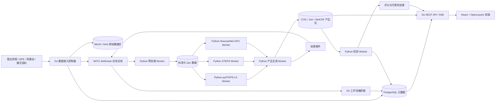

# RainPulse（雨脉）短临降水预报系统
## 技术架构与实施方案（React + Go + Python）

**文档用途：** 作为 Codex 实施基线、任务拆分依据和一期验收依据。  
**产品名称：** 雨脉短临降水预报系统（RainPulse）  
**仓库名称：** `rainpulse-nowcast`  
**文档版本：** v1.0  
**目标范围：** 0–2 小时短临降水预报，先完成稳定业务基线，再逐步加入概率集合、NowcastNet、本地微调和模式融合。

---

## 1. 技术栈结论

采用以下分工：

- **React + TypeScript：** 负责地图、时间轴、产品对比、点选查询、运行监控和检验可视化。
- **Go：** 负责业务控制面，包括数据登记、任务编排、状态机、REST API、SSE 推送、权限与配置、产品目录、运行监控和自动回退。
- **Python：** 负责计算面，包括雷达/QPE 数据读取与标准化、pySTEPS、NowcastNet、集合预报、产品生成和检验算法。

这一组合比“前后端和算法都使用 Python”更适合正式业务系统。关键不在于使用三种语言，而在于边界必须稳定：

1. React 只调用 Go，不直接调用 Python。
2. Go 不实现气象数组运算和深度学习算法。
3. Python 不承担用户接口、业务权限和全局流程编排。
4. Go 与 Python 之间只交换任务、元数据和对象存储 URI，不传输大数组。
5. 生产环境禁止 Go 通过 `exec` 临时启动 Python 脚本；Python 算法必须以常驻 Worker 运行。
6. 所有接口、事件和数据格式先定义契约，再编码实现。

---

## 2. 产品目标与一期边界

### 2.1 最终产品

每个起报时次生成：

- 未来 0–120 分钟逐 5 分钟雨强场；
- 0–1 小时累积降水；
- 0–2 小时累积降水；
- 超阈值概率；
- P10、P50、P90 等集合分位数；
- 数据质量、有效区、低质量区和缺测区；
- 各模型单独结果及融合结果；
- 后续实况检验结果。

### 2.2 一期最小闭环

一期只要求完成：

> 连续雷达/QPE 数据接入 → 标准化 → pySTEPS-LK 光流外推 → 未来 24 个 5 分钟雨强场 → 0–1h/0–2h 累积降水 → React 地图展示 → 自动实况检验。

一期暂不要求：

- NowcastNet 正式上线；
- 本地模型训练；
- 数值模式融合；
- 复杂天气类型自动识别；
- Kubernetes；
- 大规模微服务拆分；
- 在线自动更新模型权重。

---

## 3. 总体架构



### 3.1 控制面与计算面

**控制面：Go**

- 决定何时创建一轮预报；
- 判断需要执行哪些算法；
- 管理运行状态、任务重试和自动回退；
- 记录输入、配置、模型和产品版本；
- 对外提供统一 API；
- 向前端推送进度。

**计算面：Python**

- 打开 NetCDF、HDF5、GeoTIFF、Zarr 等气象数据；
- 完成重投影、重采样、时次对齐和掩膜处理；
- 执行 pySTEPS、STEPS、NowcastNet；
- 计算累积量、概率、分位数和检验指标；
- 输出标准化产品文件。

---

## 4. 技术选型

| 层级 | 推荐技术 | 说明 |
|---|---|---|
| Web | React + TypeScript + Vite | 业务前端 |
| 地图 | OpenLayers | 雷达/QPE/COG、时间动画和点选 |
| 状态与请求 | TanStack Query + Zustand | 服务端状态和少量全局状态 |
| 图表 | ECharts | 点预报、评分和可靠性曲线 |
| UI | Ant Design | 内网业务界面，减少重复开发 |
| Go HTTP | `chi` + 标准 `net/http` | 轻量、清晰、便于测试 |
| API 契约 | OpenAPI + `oapi-codegen` | 生成 Go Server 接口与 TS Client |
| 数据库访问 | PostgreSQL/PostGIS + `pgx` + `sqlc` | 强类型 SQL 和空间元数据 |
| 任务总线 | NATS JetStream | Go/Python 跨语言、持久化、支持消费组 |
| 对象存储 | MinIO 或现有 NAS/S3 兼容存储 | 原始数据、Zarr、COG、模型和回算结果 |
| Python 数值 | NumPy、SciPy、xarray、Zarr、Rasterio | 标准化和产品处理 |
| Python 算法 | pySTEPS、PyTorch、NowcastNet 适配器 | 短临算法 |
| Python 契约 | Pydantic | 校验任务、事件和配置 |
| 监控 | Prometheus + Grafana | 数据时延、运行耗时、回退和资源监控 |
| 日志 | JSON 结构化日志 | 按 `run_id/job_id` 关联 |
| 部署 | Docker Compose | 一期内网部署 |
| 测试 | Go test、pytest、Playwright | 单元、集成和端到端测试 |

### 4.1 不再采用的主链路组件

- 不使用 FastAPI 作为业务主后端；
- 不使用 Celery 作为全局任务编排器；
- 不由 React 直接调用 Python 算法接口；
- 不在 PostgreSQL、Redis、NATS 中存储完整雷达数组；
- 不在 Go 中引入 GDAL/NetCDF 计算逻辑，避免 CGO 和算法重复实现。

---

## 5. 单仓库设计

一期采用 Monorepo，避免多个仓库之间契约漂移。

```text
rainpulse-nowcast/
├── apps/
│   └── web/                         # React 前端
│       ├── src/
│       ├── tests/
│       └── package.json
│
├── services/
│   └── control/                     # Go 控制面
│       ├── cmd/
│       │   ├── api/                 # REST API + SSE
│       │   ├── orchestrator/        # 工作流、事件消费、重试
│       │   └── ingest/              # 文件/接口到达监听
│       ├── internal/
│       │   ├── api/
│       │   ├── workflow/
│       │   ├── jobs/
│       │   ├── products/
│       │   ├── verification/
│       │   ├── storage/
│       │   └── repository/
│       ├── migrations/
│       ├── sql/
│       └── go.mod
│
├── algorithms/
│   ├── rainpulse_algo/              # Python 公共包
│   │   ├── contracts/
│   │   ├── io/
│   │   ├── grids/
│   │   ├── masks/
│   │   ├── products/
│   │   └── verification/
│   ├── workers/
│   │   ├── preprocess/
│   │   ├── pysteps_lk/
│   │   ├── pysteps_steps/
│   │   ├── nowcastnet/
│   │   ├── product_builder/
│   │   └── verification/
│   ├── tests/
│   └── pyproject.toml
│
├── contracts/
│   ├── openapi.yaml                 # React ↔ Go
│   ├── events/                      # Go ↔ Python
│   │   ├── job-requested.schema.json
│   │   ├── job-completed.schema.json
│   │   └── product-published.schema.json
│   ├── data/
│   │   ├── nowcast-input.md
│   │   └── forecast-output.md
│   └── examples/
│
├── configs/
│   ├── grid.yaml
│   ├── sources.yaml
│   ├── models.yaml
│   ├── products.yaml
│   ├── thresholds.yaml
│   └── qc.yaml
│
├── deploy/
│   ├── docker-compose.yaml
│   ├── docker/
│   ├── prometheus/
│   └── grafana/
│
├── scripts/
│   ├── import_history.py
│   ├── replay_case.py
│   ├── seed_demo.sh
│   └── smoke_test.sh
│
├── docs/
│   ├── architecture.md
│   ├── data-contract.md
│   ├── event-contract.md
│   ├── api.md
│   ├── deployment.md
│   ├── verification.md
│   └── acceptance.md
│
├── Makefile
├── README.md
└── .github/workflows/
```

---

## 6. 契约优先设计

### 6.1 OpenAPI

`contracts/openapi.yaml` 是 React 与 Go 之间的唯一接口事实来源。

要求：

- Go Server 接口由 OpenAPI 生成；
- React TypeScript Client 由同一份 OpenAPI 生成；
- 禁止前后端分别手写重复 DTO；
- API 变更必须先改契约，再改实现；
- 所有接口带版本前缀 `/api/v1`。

### 6.2 事件信封

Go 与 Python 通过 NATS 交换 JSON 事件，统一结构：

```json
{
  "schema_version": "1.0",
  "event_id": "uuid",
  "event_type": "job.requested",
  "occurred_at": "2026-08-24T03:00:00Z",
  "run_id": "uuid",
  "job_id": "uuid",
  "trace_id": "uuid",
  "payload": {}
}
```

任务消息示例：

```json
{
  "schema_version": "1.0",
  "event_type": "job.requested",
  "run_id": "uuid",
  "job_id": "uuid",
  "payload": {
    "job_type": "model.pysteps_lk",
    "input_uri": "s3://rainpulse/standard/2026/08/24/0300/input.zarr",
    "output_prefix": "s3://rainpulse/products/<run_id>/pysteps-lk/",
    "grid_id": "fuzhou_1km_v1",
    "config_version": "baseline-v1",
    "model_version": "pysteps-lk-v1",
    "issue_time": "2026-08-24T03:00:00Z"
  }
}
```

结果消息示例：

```json
{
  "schema_version": "1.0",
  "event_type": "job.completed",
  "run_id": "uuid",
  "job_id": "uuid",
  "payload": {
    "status": "succeeded",
    "started_at": "2026-08-24T03:00:03Z",
    "finished_at": "2026-08-24T03:00:42Z",
    "runtime_ms": 39000,
    "assets": [
      {
        "asset_type": "forecast_zarr",
        "uri": "s3://rainpulse/products/<run_id>/pysteps-lk/forecast.zarr"
      }
    ],
    "metrics": {
      "input_missing_ratio": 0.012,
      "max_rain_rate": 72.3
    }
  }
}
```

### 6.3 消息语义

- NATS 采用 **at-least-once** 投递；
- Worker 必须幂等；
- `job_id` 唯一；
- 同一 `run_id + job_type + model_version + config_version` 建唯一约束；
- 成功写出产品后再 ACK；
- 输出先写临时路径，完成校验后原子发布；
- 重复消息不得产生重复产品记录。

---

## 7. 标准气象数据协议

### 7.1 标准输入：NowcastInput Zarr

维度：

```text
time × y × x
```

变量：

| 变量 | 类型 | 单位 | 说明 |
|---|---|---|---|
| `DBZH_QC` | float32 | dBZ | 质控后反射率 |
| `RATE_QPE` | float32 | mm/h | 瞬时雨强 |
| `QUALITY_INDEX` | float32 | 0–1 | 质量指数 |
| `VALID_MASK` | uint8 | 0/1 | 有效观测区域 |
| `LOW_QUALITY_MASK` | uint8 | 0/1 | 低质量区域 |
| `QC_FLAGS` | uint16 | bit mask | 质控标记 |
| `BEAM_HEIGHT` | float32 | m | 波束高度，可选 |
| `DATA_AGE` | float32 | min | 数据年龄 |

坐标和属性：

```text
time
x
y
crs
grid_id
resolution_m
timestep_minutes
issue_time_utc
source_name
source_version
preprocess_version
```

### 7.2 缺测规则

- 有效无降水：`RATE_QPE = 0` 且 `VALID_MASK = 1`；
- 缺测：`RATE_QPE = NaN` 且 `VALID_MASK = 0`；
- 低质量：保留观测值，同时 `LOW_QUALITY_MASK = 1`；
- 禁止将缺测直接填成 0；
- 模型适配器可临时插补，但必须保留原始掩膜并记录方法。

### 7.3 固定时间步长

- 产品每 5 分钟滚动；
- pySTEPS 一期使用固定 5 分钟步长；
- 一期输入最近 3–6 帧；
- 输出未来 24 个 5 分钟时次；
- NowcastNet 使用独立适配器完成自身时间步长、归一化和网格转换；
- 不允许同一模型输入混用 5 分钟和 10 分钟间隔。

### 7.4 标准输出：ForecastOutput

维度：

```text
member × lead_time × y × x
```

核心变量：

| 变量 | 说明 |
|---|---|
| `rain_rate` | 未来逐时次雨强 |
| `accum_60` | 0–1 小时累积降水 |
| `accum_120` | 0–2 小时累积降水 |
| `prob_gt_1` | 超过 1 mm 概率 |
| `prob_gt_5` | 超过 5 mm 概率 |
| `prob_gt_10` | 超过 10 mm 概率 |
| `prob_gt_20` | 超过 20 mm 概率 |
| `prob_gt_50` | 超过 50 mm 概率 |
| `p10` / `p50` / `p90` | 集合分位数 |
| `output_valid_mask` | 输出有效区 |
| `confidence` | 结果可信度 |

元数据必须包括：

```text
run_id
model_id
model_version
config_version
input_asset_ids
issue_time
valid_times
grid_id
runtime_ms
created_at
```

---

## 8. Go 控制面设计

### 8.1 `rainpulse-api`

职责：

- 产品、运行、点预报、区域统计和检验查询；
- 管理手动重算、模型启停和配置查询；
- 生成 MinIO 预签名 URL；
- 使用 SSE 推送运行进度；
- 不直接执行算法。

主要接口：

```text
GET  /api/v1/runs/latest
GET  /api/v1/runs
GET  /api/v1/runs/{run_id}
GET  /api/v1/runs/{run_id}/jobs
GET  /api/v1/products
GET  /api/v1/products/{product_id}
GET  /api/v1/products/{product_id}/assets
GET  /api/v1/point-forecast
GET  /api/v1/area-statistics
GET  /api/v1/verification/summary
GET  /api/v1/system/status
GET  /api/v1/events/stream

POST /api/v1/admin/runs/{run_id}/rerun
POST /api/v1/admin/models/{model_id}/enable
POST /api/v1/admin/models/{model_id}/disable
```

### 8.2 `rainpulse-orchestrator`

职责：

- 创建预报运行；
- 执行状态机；
- 发布任务；
- 处理 Worker 完成/失败事件；
- 进行重试和超时判定；
- 触发降级和回退；
- 触发产品发布；
- 后续实况到达时触发检验。

运行状态：

```text
WAITING
RECEIVED
VALIDATING
PREPROCESSING
BASELINE_RUNNING
BASELINE_READY
ENHANCED_RUNNING
PRODUCT_BUILDING
PUBLISHED
VERIFYING
VERIFIED
DEGRADED
FAILED
SKIPPED
```

### 8.3 `rainpulse-ingest`

职责：

- 监听共享目录、HTTP 回调或定时轮询；
- 计算文件哈希；
- 登记原始资产；
- 判断一个起报时次是否具备最低输入条件；
- 创建运行，不解析大数组。

---

## 9. Python Worker 设计

所有 Worker 使用同一运行框架：

1. 从 NATS 拉取任务；
2. 使用 Pydantic 校验消息；
3. 从对象存储读取输入；
4. 执行计算；
5. 校验结果；
6. 原子写出产品；
7. 发布完成或失败事件；
8. 成功后 ACK。

### 9.1 `preprocess-worker`

- 打开原始数据；
- 统一投影和网格；
- 固定时间步长；
- 单位转换；
- 缺测三态处理；
- 输出 `NowcastInput Zarr`；
- 生成输入质量摘要。

### 9.2 `pysteps-lk-worker`

- 读取最近 3–6 帧；
- Lucas–Kanade 估计二维运动场；
- 半拉格朗日逐 5 分钟外推；
- 生成 0–120 分钟确定性雨强；
- 输出运动场 U/V 供诊断；
- 记录降水覆盖率、最大雨强和运行耗时。

### 9.3 `pysteps-steps-worker`

二期启用：

- 尺度分解；
- 运动、降水和噪声扰动；
- 生成多成员集合；
- 输出超阈值概率和分位数；
- 通过 Brier Score、CRPS 和可靠性曲线检验。

### 9.4 `nowcastnet-worker`

二期启用：

- GPU 常驻进程；
- 服务启动时加载模型一次；
- 每次任务只读取输入并推理；
- 模型适配器负责变量、归一化、裁剪、时间步长和网格转换；
- 支持单成员与多成员生成；
- 模型失败不能影响 pySTEPS 基线发布。

禁止：

- 每个任务重新加载模型；
- Go 直接调用 Python 函数；
- 将完整数组通过 HTTP/NATS 传输；
- 未经离线回算直接替换业务产品。

### 9.5 `product-builder-worker`

- 计算 0–1h、0–2h 累积降水；
- 计算概率和分位数；
- 输出内部 Zarr；
- 输出浏览器展示用 COG；
- 生成统计摘要；
- 创建缩略图和图例元数据。

### 9.6 `verification-worker`

- 预报与后续实况自动配对；
- 计算 CSI、POD、FAR、FSS、位置误差；
- 概率产品计算 Brier Score、CRPS、可靠性曲线；
- 按时效、雨强、天气类型和质量分组；
- 0–1h、1–2h 和 0–2h 分开报告；
- 结果写入 PostgreSQL，详细栅格结果写入对象存储。

---

## 10. React 前端设计

### 10.1 页面

#### 实时短临

- 实况、逐时次预报、累积降水和概率产品切换；
- 0–120 分钟时间轴；
- 播放、暂停、逐帧；
- 起报时间、有效时间、模型和质量状态；
- 缺测/低质量区域叠加；
- 图例和单位。

#### 点选查询

- 点击地图返回点位未来两小时雨强；
- 0–1h、0–2h 累积；
- 超阈值概率；
- P10/P50/P90；
- 当前质量和回退状态。

#### 模型对比

- pySTEPS、NowcastNet、融合和后续实况并排或滑动对比；
- 同一时次、同一色标；
- 显示评分摘要。

#### 运行监控

- 最新数据时间；
- 当前运行状态；
- 各任务耗时；
- 缺测比例；
- GPU/CPU Worker 状态；
- 最近回退次数；
- 最近运行成功率。

#### 检验分析

二期补充：

- 时效曲线；
- 雨强等级评分；
- 可靠性曲线；
- 天气过程筛选；
- 模型版本对比。

### 10.2 前端数据原则

- 前端只消费 Go API；
- 大栅格通过 COG 预签名 URL 加载；
- 列表和元数据使用 REST；
- 运行状态使用 SSE；
- 同一产品使用固定色标；
- 前端不得推断缺测，必须使用后端给出的掩膜和质量字段。

---

## 11. 数据库设计

一期至少包含以下表：

```text
data_sources
input_assets
forecast_runs
jobs
job_attempts
model_versions
config_versions
model_runs
products
product_assets
verification_runs
verification_metrics
alerts
outbox_events
```

关键约束：

- `input_assets.sha256` 唯一；
- 一个起报时次可有多次重算，但每次有独立 `run_id`；
- `job_id` 唯一；
- 产品记录必须关联输入、配置和模型版本；
- 删除元数据不得直接删除对象存储文件，采用生命周期任务清理；
- 所有业务时间内部使用 UTC，前端按配置时区显示。

---

## 12. 对象存储目录

```text
s3://rainpulse/raw/{source}/{yyyy}/{mm}/{dd}/{issue_time}/
s3://rainpulse/standard/{grid_id}/{yyyy}/{mm}/{dd}/{issue_time}/input.zarr
s3://rainpulse/products/{run_id}/{model_id}/{model_version}/
s3://rainpulse/verification/{run_id}/
s3://rainpulse/models/{model_id}/{model_version}/
s3://rainpulse/replay/{case_id}/
```

写入规则：

- 临时路径：`.../_tmp/{job_id}/`
- 校验成功后发布到正式路径；
- 资产写入后计算 SHA-256；
- 目录和对象均不得依赖中文文件名；
- 产品文件名包含起报时次、时效、变量和版本。

---

## 13. 门控与自动回退

| 条件 | 行为 |
|---|---|
| 数据完整、时效正常、QI 高 | 运行全部已启用模型 |
| QI 一般 | 运行模型，但降低复杂模型融合权重和产品可信度 |
| 局部缺测 | 使用掩膜运行，缺测区标记低可信 |
| 历史帧不足 | 跳过需要固定帧数的模型 |
| pySTEPS 失败 | 本轮标记失败，不伪造产品 |
| NowcastNet 失败 | 自动发布 pySTEPS 基线 |
| GPU 不可用 | 跳过 NowcastNet，保持基线 |
| 雷达短时断档 | 延用上一轮预报并明确数据年龄 |
| 雷达大面积或长时间缺测 | 一、二期标记短临不可用；三期可切换模式 QPF |

一期不得实现“固定 1 小时切换模式”。融合权重后续根据历史回算确定技巧交叉点。

---

## 14. 部署拓扑

### 14.1 开发与一期试运行

Docker Compose 服务：

```text
web
api
orchestrator
ingest
postgres
nats
minio
preprocess-worker
pysteps-worker
product-worker
verification-worker
prometheus
grafana
```

二期增加：

```text
pysteps-steps-worker
nowcastnet-worker
gpu-exporter
```

### 14.2 节点建议

- 应用节点：React、Go、PostgreSQL、NATS、监控；
- CPU 算法节点：预处理、pySTEPS、产品生成和检验；
- GPU 节点：NowcastNet 常驻推理和后续训练；
- 存储节点：MinIO 或现有 NAS。

一期不引入 Kubernetes。只有在出现多试点区域、多 GPU 调度或服务数量明显增长后再评估。

---

## 15. 可观测性

每个日志必须包含：

```text
timestamp
level
service
run_id
job_id
trace_id
event
duration_ms
error_code
```

Prometheus 指标至少包括：

```text
rainpulse_data_delay_seconds
rainpulse_run_total
rainpulse_run_failed_total
rainpulse_job_duration_seconds
rainpulse_job_retry_total
rainpulse_input_missing_ratio
rainpulse_product_publish_delay_seconds
rainpulse_model_fallback_total
rainpulse_worker_up
rainpulse_gpu_memory_bytes
```

告警：

- 连续两个起报时次无数据；
- 输入数据超过允许时效；
- 产品生成失败；
- pySTEPS Worker 不可用；
- NowcastNet 连续失败；
- 对象存储空间不足；
- P95 生成时延超限；
- 缺测比例异常升高。

---

## 16. 测试体系

### 16.1 单元测试

- Go 状态机、重试和门控；
- Python 数据协议、单位转换、掩膜和累积；
- React 时间轴和产品切换。

### 16.2 契约测试

- OpenAPI 兼容；
- NATS 事件 JSON Schema；
- Zarr 变量、维度、单位和属性；
- 旧版本事件兼容。

### 16.3 集成测试

- 原始样例 → 标准化 → pySTEPS → 产品 → API → React；
- 重复消息；
- Worker 超时；
- NATS 重连；
- MinIO 写入失败；
- GPU 不可用。

### 16.4 黄金个例

至少保存：

- 无降水；
- 稳定层状降水；
- 快速移动雨带；
- 局地强对流；
- 局部缺测；
- 大面积缺测；
- 数据延迟；
- 极端雨强。

同一输入和同一版本必须得到可追溯结果。

---

## 17. 分期实施方案

## 第 0 阶段：协议冻结与项目骨架（约 1 周）

交付：

- Monorepo；
- OpenAPI；
- 事件 JSON Schema；
- `grid.yaml`；
- 标准 Zarr 协议；
- Docker Compose；
- PostgreSQL 迁移；
- NATS、MinIO；
- 一组脱敏真实样例；
- CI 和 Smoke Test。

通过条件：

- React、Go、Python 三端都能启动；
- Go 能发布一个模拟任务；
- Python 能消费并回传结果；
- React 能看到运行状态；
- 契约测试通过。

## 第一期：pySTEPS 确定性最小闭环（约 4–6 周）

### Sprint 1：数据接入与标准化

- 实现 `ingest`；
- 登记原始资产；
- Python 读取样例；
- 输出标准 Zarr；
- 完成时次、网格、单位和掩膜检查。

### Sprint 2：pySTEPS-LK

- 接入 Lucas–Kanade；
- 输出 24 个时效；
- 保存 U/V；
- 增加持续性和整场平移基线；
- 完成黄金个例测试。

### Sprint 3：产品与 API

- 生成 COG、累积降水；
- Go 产品目录；
- 预签名 URL；
- 运行、产品、点查询 API；
- SSE 进度。

### Sprint 4：React 最小界面

- 实时地图；
- 时间轴动画；
- 0–1h/0–2h 切换；
- 点选查询；
- 运行监控。

### Sprint 5：检验、回退和试运行

- CSI、POD、FAR、FSS；
- 自动实况配对；
- 故障注入；
- pySTEPS 失败处理；
- 连续运行至少 7 天；
- 一期报告。

一期通过门槛：

- 自动生成完整 0–2h 产品；
- 运行链路可追溯、可重算、可回放；
- 产品按时生成率初始建议不低于 98%；
- 输入到产品 P95 时延初始建议不超过 180 秒；
- pySTEPS 总体跑赢持续性和整场平移基线；
- 缺测、无降水和低质量状态没有被混同；
- 任一任务重复投递不会生成重复产品。

具体数值在第 0 阶段根据区域、数据和硬件冻结。

## 第二期：概率集合与 NowcastNet（约 2–3 个月）

交付：

- STEPS 集合；
- 超阈值概率；
- Brier Score、CRPS 和可靠性曲线；
- NowcastNet 预训练权重离线推理；
- 历史过程回算；
- 实时并行灰度；
- 模型对比页面；
- GPU 运行监控。

通过条件：

- 0–1h 与 1–2h 分开检验；
- 中到大雨和暴雨不得明显退化；
- NowcastNet 在目标时效有稳定增益后才参与融合；
- NowcastNet 失败时基线仍可发布；
- 概率产品可解释并可校准。

## 第三期：本地微调、动态融合与业务化（约 3–6 个月）

交付：

- 连续 5 年历史样本库；
- 按完整天气过程切分训练/验证/测试；
- NowcastNet 本地迁移微调；
- 模式 QPF 适配；
- 技巧交叉点标定；
- 动态融合；
- 概率校准；
- 消融实验；
- 正式业务版。

---

## 18. Codex 实施规则

Codex 必须遵守：

1. 先实现契约和测试，再实现业务逻辑。
2. 每个 PR 只完成一个可验收目标，禁止一次性大改。
3. 不改变已冻结的数据变量、单位、掩膜和状态定义。
4. 禁止把大数组放入 PostgreSQL、NATS 或 REST JSON。
5. 禁止把缺测填成无降水。
6. Go 和 Python 之间只通过 NATS、对象存储和数据库元数据协作。
7. Go 不通过 `exec` 启动 Python 算法。
8. Python Worker 必须常驻、幂等、支持重试和健康检查。
9. NowcastNet 必须常驻 GPU，禁止每个任务重新加载权重。
10. 所有任务都必须带 `run_id`、`job_id`、`model_version`、`config_version`。
11. 所有时间内部使用 UTC。
12. 所有配置进入 `configs/` 或环境变量，禁止硬编码区域、路径和阈值。
13. 输出必须先写临时路径，校验成功后原子发布。
14. 任何模型失败不得阻塞可用基线产品。
15. 模型权重和融合权重不得在线自动修改；必须离线检验、审核和灰度发布。
16. 一期不实现 Kubernetes、复杂权限、复杂天气分类和在线训练。
17. 每项功能必须同时提交代码、测试、文档和可重复运行命令。
18. 代码提交前必须通过：
    - Go format、lint、test；
    - Python format、lint、pytest；
    - React typecheck、lint、unit test；
    - Docker Compose smoke test。

---

## 19. Codex 第一批任务

### RP-000：建立 Monorepo

完成目录、Makefile、README、CI、统一开发命令。

验收：

```bash
make bootstrap
make test
make dev-up
make smoke
```

全部成功。

### RP-001：建立契约

完成：

- `openapi.yaml`；
- 三类事件 Schema；
- 输入 Zarr 文档；
- 输出产品文档；
- 生成 Go 和 TypeScript 类型。

### RP-002：基础设施

完成：

- PostgreSQL；
- NATS JetStream；
- MinIO；
- 数据库迁移；
- 健康检查；
- Compose 启停。

### RP-003：Go 运行与任务状态机

完成：

- 创建 `forecast_run`；
- 创建任务；
- 发布模拟 NATS 消息；
- 消费结果事件；
- 更新状态；
- SSE 推送。

### RP-004：Python Worker SDK

完成：

- NATS 消费框架；
- Pydantic 校验；
- 幂等；
- 临时输出；
- 完成/失败事件；
- 健康检查；
- 模拟 Worker。

### RP-005：真实样例标准化

完成：

- 读取一组真实雷达/QPE；
- 输出标准 Zarr；
- 缺测三态；
- 数据质量摘要；
- 契约测试。

### RP-006：pySTEPS-LK

完成：

- 最近 3 帧输入；
- U/V；
- 24 个未来时效；
- Zarr 输出；
- 至少 3 个黄金个例测试。

### RP-007：产品生成

完成：

- 0–1h、0–2h；
- 每时效 COG；
- 元数据；
- 对象存储登记。

### RP-008：React 最小页面

完成：

- 最新运行；
- COG 图层；
- 时间轴；
- 产品切换；
- SSE 状态；
- 错误与缺测提示。

### RP-009：端到端闭环

使用固定样例执行：

```text
导入 → 创建运行 → 标准化 → pySTEPS → 产品 → API → React 展示
```

形成自动化 E2E 测试和演示脚本。

---

## 20. 一期完成定义

同时满足以下条件，才认定一期完成：

- 从真实连续样例自动生成 0–2h 预报；
- React 可查看逐时次和累积产品；
- 运行状态、输入、模型、配置和输出可追溯；
- 同一案例可一键回放；
- 持续性、整场平移和 pySTEPS 可比较；
- 数据缺测、延迟和 Worker 故障有明确处理；
- 任务可重试且不会重复发布；
- 连续试运行达到约定时长；
- 形成部署文档、接口文档、数据协议和一期检验报告。

---

## 21. 架构红线

以下做法不得进入主分支：

- React 直接请求 Python Worker；
- Go 内嵌 Python 或按任务执行 Python 脚本；
- 用 HTTP JSON 传输完整雷达栅格；
- 将 NetCDF/Zarr 二进制写入 PostgreSQL；
- 把 `NaN` 或缺测统一转为 0；
- 每轮重新加载 NowcastNet；
- 前端自行推测数据质量；
- 未记录模型和配置版本；
- 未经本地回算直接宣布 NowcastNet 替换基线；
- 一期提前建设复杂微服务、Kubernetes 或在线训练平台。

---

## 22. 最终技术路线

```text
React：产品交互和气象可视化
    ↓ REST / SSE
Go：控制面、工作流、产品目录、状态与回退
    ↓ NATS 任务 + 对象存储 URI
Python：数据标准化、pySTEPS、NowcastNet、产品和检验
    ↓ Zarr / COG / 指标
Go：统一发布
    ↓
React：业务展示
```

一期先把这条链路稳定跑通；二期加入 STEPS 与 NowcastNet；三期再做本地微调、模式融合和概率校准。
