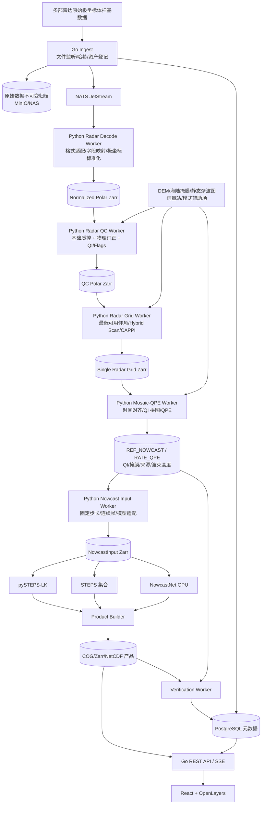

# RainPulse（雨脉）短临降水预报系统
## 技术架构与实施方案（React + Go + Python，含原始雷达基数据质控）

**文档用途：** 作为 Codex 实施基线、任务拆分依据和阶段验收依据。  
**产品名称：** 雨脉短临降水预报系统（RainPulse）  
**仓库名称：** `rainpulse-nowcast`  
**文档版本：** v1.1  
**本次修订：** 将“雷达基数据质控、Hybrid Scan、QI 多雷达拼图、QPE”纳入系统主链路，不再假设外部已经提供稳定的雷达拼图或 QPE。

---

## 0. 修订结论

原 v1.0 的工程链路默认输入已经是连续、统一网格、基本可信的雷达拼图或 QPE：

```text
雷达拼图 / QPE → 标准化 → pySTEPS → 预报产品
```

实际交付条件是**原始雷达基数据**，因此这个假设不成立。新的主链路必须调整为：

```text
原始极坐标体扫基数据
→ 数据完整性与雷达健康检查
→ 极坐标质控与物理订正
→ 动态最低可用仰角 / Hybrid Scan
→ 多雷达时间对齐与 QI 质量拼图
→ QPE
→ 固定时间步长的短临输入序列
→ pySTEPS / STEPS / NowcastNet
→ 累积降水与概率产品
→ 实况检验
```

关键改变不是增加一个简单的 `preprocess-worker`，而是增加一套完整的**雷达数据生产子系统**。

### 0.1 对一期周期的影响

原“4–6 周完成 pySTEPS 最小闭环”的估计，前提是已有稳定的 `REF_NOWCAST / RATE_QPE` 输入。现在从原始基数据开始，建议改为：

- **第 0 阶段：** 雷达资料盘点、契约冻结、项目骨架，约 1–2 周；
- **第一阶段 A：** 基础雷达质控、Hybrid Scan、QI 拼图和基础 QPE，约 6–8 周；
- **第一阶段 B：** pySTEPS、产品服务、React 展示和检验，约 4–6 周，可与 A 后半段并行；
- **首个可用内部版本：** 约 10–14 周。

该周期按“多雷达、原始基数据、2 名 Python 算法工程师参与”估算。雷达数量、数据格式差异和双偏振字段完整性会直接影响周期。

---

## 1. 技术栈与职责边界

### 1.1 React + TypeScript

负责：

- 实时短临地图；
- 雷达原始/质控后对比；
- QI、质控标记、来源雷达和波束高度展示；
- 时间轴、点选查询和模型对比；
- 雷达健康、任务状态、告警和检验可视化。

### 1.2 Go 控制面

负责：

- 原始文件到达监听与资产登记；
- 雷达站、扫描策略、配置版本和算法版本管理；
- 单雷达体扫质控工作流；
- 多雷达分析时次工作流；
- 短临预报工作流；
- 任务发布、超时、重试、回退和状态机；
- PostgreSQL 元数据、产品目录、REST API 和 SSE；
- 不执行气象数组计算。

### 1.3 Python 计算面

负责：

- 原始雷达格式解码和极坐标标准化；
- 雷达健康与数据完整性分析；
- 径向干扰、地物杂波、海杂波、异常传播和生物回波识别；
- PHIDP/KDP、衰减、速度、亮带/VPR、湿天线罩等物理处理；
- DEM 波束遮挡、最低可用仰角、Hybrid Scan 和网格化；
- 综合 QI、多雷达时间对齐、质量拼图和 QPE；
- pySTEPS、STEPS、NowcastNet、产品生成和检验。

### 1.4 不变的架构原则

1. React 只调用 Go，不直接连接 Python Worker。
2. Go 不实现雷达数组、光流和深度学习算法。
3. Python 不承担用户权限和全局业务编排。
4. Go 与 Python 只交换任务、元数据和对象存储 URI，不传输完整雷达数组。
5. 原始基数据必须原样归档，不允许被质控结果覆盖。
6. 生产环境禁止 Go 通过 `exec` 临时启动 Python 脚本。
7. 所有质控模块、阈值、雷达参数和算法输出必须版本化。

---

## 2. 产品目标与阶段边界

### 2.1 最终产品

系统最终同时输出三类产品。

#### A. 雷达质控与诊断产品

- 单雷达原始/质控后 PPI；
- `DBZH_RAW`、`DBZH_QC`；
- `QUALITY_INDEX` 及其分量；
- `QC_FLAGS`；
- 干扰、杂波、遮挡、衰减、亮带和湿天线罩诊断；
- 雷达健康、标定偏差和数据完整性；
- 来源仰角、波束高度和遮挡比例。

#### B. 省级实况与 QPE 产品

- 单雷达 Hybrid Scan；
- 多雷达 `REF_NOWCAST`；
- `RATE_QPE` 瞬时雨强；
- 来源雷达、来源仰角、数据年龄；
- 有效区、低质量区和缺测区；
- 雨量站订正后的 QPE（二阶段）。

#### C. 短临预报产品

- 未来 0–120 分钟逐 5 分钟雨强场；
- 0–1 小时、0–2 小时累积降水；
- 超阈值概率；
- P10、P50、P90；
- 各模型单独结果和融合结果；
- 预报检验结果。

### 2.2 第一阶段最小闭环

第一阶段不再是“QPE 接入后直接跑 pySTEPS”，而是：

```text
真实雷达基数据
→ 可重复解码
→ 基础极坐标质控
→ Hybrid Scan
→ QI 多雷达拼图
→ 基础 QPE
→ 连续 3–6 帧短临输入
→ pySTEPS-LK
→ 0–2h 产品
→ React 展示
→ 自动检验
```

第一阶段暂不要求：

- 深度学习质控模型；
- 所有高级双偏振算法一次到位；
- NowcastNet 正式上线；
- 本地训练；
- 模式融合；
- Kubernetes；
- 在线自动更新模型或 QI 权重。

---

## 3. 总体架构



### 3.1 不把每个质控算法拆成微服务

第一阶段只部署三个雷达计算 Worker：

- `radar-decode-worker`；
- `radar-qc-worker`；
- `mosaic-qpe-worker`，其中可包含网格化阶段，后续负载增加再拆出 `radar-grid-worker`。

径向干扰、海杂波、遮挡、衰减等是 `radar-qc-worker` 内部的可插拔算法模块，不是独立容器。这样既保证模块化，也避免服务数量失控。

---

## 4. 三类运行工作流

不能继续只使用一个 `forecast_run` 状态机。原始多雷达体扫到预报之间存在三个不同粒度的工作流。

### 4.1 单雷达体扫工作流：`radar_scan_run`

每部雷达、每个体扫独立运行：

```text
RAW_RECEIVED
→ RAW_VALIDATING
→ DECODING
→ NORMALIZED
→ QC_RUNNING
→ QC_READY
→ GRID_RUNNING
→ RADAR_GRID_READY
```

异常状态：

```text
DEGRADED
FAILED
SKIPPED
```

单部雷达失败不能阻塞其他雷达。

### 4.2 多雷达分析时次：`analysis_cycle`

以统一分析时刻为单位，例如每 5 分钟一个分析时次：

```text
OPEN
→ COLLECTING_RADARS
→ ALIGNING
→ MOSAIC_RUNNING
→ QPE_RUNNING
→ ANALYSIS_READY
```

工作原则：

- 在配置的时间窗口内，为每部雷达选择最接近分析时刻且质量可用的体扫；
- 某部雷达缺失时，使用其他雷达继续生成降级产品；
- 记录本分析时次实际参与的雷达、时差和质量；
- 满足发布门槛后生成 `REF_NOWCAST / RATE_QPE`；
- 不要求等待所有雷达无条件到齐。

### 4.3 短临预报工作流：`forecast_run`

只有 `analysis_cycle` 达到 `NOWCAST_INPUT_READY` 门槛，并已积累固定时间步长的连续帧后，才允许触发：

```text
INPUT_READY
→ BASELINE_RUNNING
→ BASELINE_READY
→ ENHANCED_RUNNING
→ PRODUCT_BUILDING
→ PUBLISHED
→ VERIFYING
→ VERIFIED
```

这种三级运行模型能避免：

- 一部雷达晚到导致整条链路卡死；
- 将单雷达质控失败误判为整次预报失败；
- 多雷达拼图、QPE 和预报状态混在一个表中。

---

## 5. 雷达质控子系统

### 5.1 基本原则

1. 主要质控在原始极坐标距离库和径向层面完成。
2. 先质控再网格化，避免杂波和干扰经插值扩散。
3. 每部雷达独立配置，不假设型号、波段、扫描策略和双偏振字段一致。
4. 每一次修正都必须留下 `QC_FLAGS`、订正量和可信度。
5. 无法确认的数据宁可降权或标记缺测，不得伪造为无降水。
6. 静态先验、规则算法和物理算法优先，深度学习质控放在第三阶段。

### 5.2 第一阶段必须实现的模块

#### 5.2.1 数据完整性与雷达健康

检查：

- 文件可读性和校验和；
- 体扫开始/结束时间；
- 仰角数量和扫描完整性；
- 方位覆盖和径向数量；
- 距离库数量、库长和最大探测距离；
- 字段是否存在、单位是否正确；
- 噪声、缺失径向和整层异常；
- 设备状态字段及其变化。

输出：

```text
SCAN_COMPLETENESS
FIELD_AVAILABILITY
NOISE_LEVEL
CHANNEL_STATUS
RADAR_HEALTH
```

#### 5.2.2 径向信号干扰

第一版采用规则与模糊逻辑：

- 径向有效回波占比；
- 连续异常长度；
- 相邻方位差异；
- 纹理；
- 多仰角一致性；
- 前后体扫持续性；
- DBZH 与速度、谱宽、双偏振变量的一致性。

输出：

```text
INTERFERENCE_TYPE
P_RADIAL_INTERFERENCE
RADIAL_INTERFERENCE flag
```

处理：

- 小范围短时干扰：有限修复并保留修复标记；
- 大范围或持续干扰：标记缺测，由邻近雷达补充；
- 无法确定：标记低质量，不进入 QPE 主计算。

#### 5.2.3 静态地物杂波与基础非气象回波

- 基于长期晴空数据建立每部雷达、每个仰角的静态杂波概率图；
- 首版引入空间纹理、速度、谱宽和可用双偏振字段；
- 生物回波可先做基础规则识别；
- 所有静态图必须版本化并可回溯。

#### 5.2.4 海杂波与异常传播基础识别

沿海参数方案至少结合：

- 海陆掩膜和海岸线距离；
- 仰角和波束高度；
- 反射率纹理；
- 速度与谱宽；
- 垂直连续性；
- 前后体扫连续性；
- 相邻雷达一致性。

输出：

```text
P_SEA_CLUTTER
P_AP
P_METEO
```

禁止按海陆掩膜直接删除所有海面回波。

#### 5.2.5 DEM 波束遮挡

为每部雷达、每个仰角预计算：

- 波束中心、顶部和底部高度；
- 部分遮挡比例；
- 累计遮挡比例；
- 雷达阴影区；
- 最低可用仰角。

处理：

- 轻度遮挡：有限订正并降低 QI；
- 中度遮挡：优先更高仰角或其他雷达；
- 严重遮挡：不进行大倍数放大；
- 完全遮挡：标记缺测。

#### 5.2.6 缺测三态

严格区分：

```text
NO_RAIN：有有效观测，确认无降水
MISSING：没有有效观测
LOW_QUALITY：有观测但可信度不足
```

### 5.3 第二阶段提高定量精度

- 双偏振模糊逻辑分类；
- PHIDP 系统相位、解缠、异常跳变和平滑；
- 稳健 KDP；
- ZPHI/KDP/比衰减订正；
- 湿天线罩检测；
- 速度退模糊；
- 融化层与亮带识别；
- VPR 订正；
- 多雷达标定偏差订正；
- 雨量站融合 QPE。

### 5.4 第三阶段福建本地智能增强

- 福建本地径向干扰分类/分割模型；
- 海杂波与 AP 机器学习复核；
- 台风湿天线罩智能识别；
- 异常数据分割；
- 质控结果与短临模型联合优化。

---

## 6. 质控模块接口与配置

### 6.1 Python 质控模块接口

```python
from typing import Protocol

class RadarQCModule(Protocol):
    name: str
    version: str

    def is_applicable(self, volume, context) -> bool:
        ...

    def apply(self, volume, context):
        """返回修正字段、质量分量、QC flags、诊断指标。"""
        ...
```

要求：

- 模块可按配置启停和排序；
- 输入字段不具备时必须显式跳过并记录原因；
- 不允许模块悄悄替换字段或单位；
- 每个模块输出自己的版本和运行指标；
- 同一输入、配置和版本应得到可重复结果。

### 6.2 参数配置层级

```text
系统默认参数
  ↓
沿海 / 山区 / 强天气参数方案
  ↓
单雷达参数
  ↓
特定版本的临时覆盖参数
```

示例目录：

```text
configs/
├── radars/
│   ├── radar_fz01.yaml
│   ├── radar_xm01.yaml
│   └── ...
├── qc/
│   ├── common.yaml
│   ├── profiles/
│   │   ├── coastal.yaml
│   │   ├── mountain.yaml
│   │   └── typhoon.yaml
│   └── flag-definitions.yaml
├── mosaic.yaml
├── qpe.yaml
├── grid.yaml
└── models.yaml
```

单雷达配置至少包括：

```text
radar_id
site_lon/site_lat/site_alt
radar_band
beam_width
scan_strategy
field_mapping
field_units
nyquist_velocity
range_resolution
azimuth_resolution
calibration_offsets
dual_pol_available
dem_asset_version
clutter_map_version
qc_profile
```

未确认的参数不得由 Codex 猜测。

---

## 7. 数据协议

### 7.1 原始资产：`RawRadarAsset`

元数据：

```text
asset_id
radar_id
source_uri
source_format
sha256
volume_start_time
volume_end_time
received_at
file_size
source_version
```

原始文件只读归档。

### 7.2 标准极坐标体扫：`NormalizedRadarVolume`

推荐内部存储为 Zarr，保留极坐标结构：

```text
sweep / ray / gate
```

坐标：

```text
azimuth
elevation
range
time
sweep_start_ray_index
sweep_end_ray_index
```

可用变量按雷达实际字段映射：

```text
DBZH
ZDR
RHOHV
PHIDP
VR
SW
SNR
```

属性：

```text
radar_id
site_lon/site_lat/site_alt
radar_band
scan_strategy
source_format
field_mapping_version
decoder_version
```

### 7.3 质控后极坐标体扫：`QCRadarVolume`

至少包含：

| 字段 | 类型 | 说明 |
|---|---:|---|
| `DBZH_RAW` | float32 | 原始反射率 |
| `DBZH_QC` | float32 | 质控与订正后反射率 |
| `ZDR_QC` | float32 | 可选 |
| `PHIDP_QC` | float32 | 可选 |
| `KDP` | float32 | 可选 |
| `VR_QC` | float32 | 可选 |
| `QUALITY_INDEX` | float32 | 0–1 综合质量 |
| `QC_FLAGS` | uint32 | 位标记 |
| `VALID_MASK` | uint8 | 是否有效 |
| `LOW_QUALITY_MASK` | uint8 | 低质量 |
| `BLOCKAGE_RATE` | float32 | 遮挡比例 |
| `ATTENUATION_CORRECTION` | float32 | 衰减订正量 |
| `P_METEO` | float32 | 气象回波概率 |
| `P_AP` | float32 | AP 概率 |
| `P_SEA_CLUTTER` | float32 | 海杂波概率 |
| `P_RADIAL_INTERFERENCE` | float32 | 径向干扰概率 |

`QC_FLAGS` 使用 `uint32`，避免后续标记位不够。

建议第一版标记：

```text
GROUND_CLUTTER
SEA_CLUTTER
ANOMALOUS_PROPAGATION
RADIAL_INTERFERENCE
HARDWARE_ANOMALY
BIOLOGICAL_ECHO
BEAM_BLOCKED
ATTENUATED
WET_RADOME
BRIGHT_BAND
VELOCITY_ALIASED
LOW_SNR
MISSING
CORRECTED
LOW_QUALITY
```

### 7.4 单雷达网格与 Hybrid Scan：`RadarGrid`

维度：

```text
y × x
```

字段：

```text
DBZH_QC
QUALITY_INDEX
QC_FLAGS
SOURCE_ELEVATION
BEAM_HEIGHT
BLOCKAGE_RATE
DATA_AGE
VALID_MASK
```

### 7.5 多雷达分析产品：`RadarAnalysis`

字段：

```text
DBZH_RAW
DBZH_QC
REF_NOWCAST
RATE_QPE
QUALITY_INDEX
QI_METEO
QI_BLOCKAGE
QI_BEAM_HEIGHT
QI_ATTENUATION
QI_INTERFERENCE
QI_TIME
QI_CALIBRATION
QI_RANGE
QC_FLAGS
SOURCE_RADAR
SOURCE_ELEVATION
BEAM_HEIGHT
BLOCKAGE_RATE
DATA_AGE
INTERFERENCE_TYPE
VALID_MASK
LOW_QUALITY_MASK
ALGORITHM_VERSION
```

`SOURCE_RADAR` 和 `INTERFERENCE_TYPE` 建议使用整数编码，并在属性中保存代码表，避免在大栅格中存字符串。

### 7.6 短临输入：`NowcastInput`

维度：

```text
time × y × x
```

至少包含：

```text
DBZH_QC
RATE_QPE
QUALITY_INDEX
QC_FLAGS
VALID_MASK
LOW_QUALITY_MASK
BEAM_HEIGHT
DATA_AGE
```

时间规则：

- 产品每 5 分钟滚动；
- pySTEPS 内部固定 5 分钟步长；
- 输入最近 3–6 帧；
- 缺少固定帧数时不触发相应模型；
- NowcastNet 由独立适配器处理其时间步长和归一化协议。

---

## 8. 综合质量指数 QI

### 8.1 QI 分量

至少计算：

```text
QI_METEO
QI_BLOCKAGE
QI_BEAM_HEIGHT
QI_ATTENUATION
QI_INTERFERENCE
QI_TIME
QI_CALIBRATION
QI_RANGE
```

第一版可采用可配置的乘积或加权惩罚方式，不能把公式硬编码在算法中。

参考形式：

```text
QUALITY_INDEX =
QI_METEO
× QI_BLOCKAGE
× QI_BEAM_HEIGHT
× QI_ATTENUATION
× QI_INTERFERENCE
× QI_TIME
× QI_CALIBRATION
× QI_RANGE
```

距离因子只作为综合质量中的一部分，首版建议影响控制在约 5%–10%，最终由历史案例标定。

### 8.2 区域参数重点

- 沿海和海岛：海杂波、AP、电磁干扰、衰减和时效；
- 山区：遮挡、地物杂波和波束高度；
- 城市/港口：径向干扰、固定建筑杂波和无线电环境；
- 台风：衰减、湿天线罩、扫描完整性和时间差；
- 多雷达重叠区：标定偏差、仰角和时间一致性。

### 8.3 QI 必须可解释

前端和 API 不仅展示一个最终 QI，还要能查询每个 QI 分量。否则无法判断低质量到底来自遮挡、干扰、远距离还是数据过期。

---

## 9. Hybrid Scan、多雷达拼图与 QPE

### 9.1 Hybrid Scan

按方位和距离动态选择：

> 最低、未被严重遮挡、未被杂波污染、仍能代表近地面降水的有效仰角。

不固定长期使用 0.5°。

### 9.2 多雷达拼图

步骤：

1. 剔除明确无效、完全遮挡和严重干扰数据；
2. 对有效雷达计算综合 QI；
3. 优先选择 QI 最高的雷达；
4. 多雷达 QI 接近时加权融合；
5. 来源边界仅做窄范围平滑；
6. 保存来源雷达、来源仰角、波束高度和数据年龄。

反射率融合必须：

```text
dBZ → 线性 Z → 加权融合 → dBZ
```

禁止直接平均 dBZ。

### 9.3 两条拼图产品线

#### `REF_NOWCAST`

优先保证：

- 回波结构；
- 时间连续性；
- 光流运动估计稳定性。

#### `RATE_QPE`

优先保证：

- 近地面代表性；
- 降水估计可信度；
- 双偏振和雨量站订正质量。

第一阶段先实现基础 QPE；第二阶段加入双偏振精细算法和雨量站订正。

---

## 10. Go 控制面设计

### 10.1 `rainpulse-ingest`

- 监听共享目录、HTTP 回调或定时轮询；
- 识别 `radar_id` 和体扫时次；
- 计算 SHA-256；
- 原始文件不可变归档；
- 创建 `radar_scan_run`；
- 不解析大数组。

### 10.2 `rainpulse-orchestrator`

分别编排：

- `radar_scan_run`；
- `analysis_cycle`；
- `forecast_run`。

负责：

- 发布任务；
- 处理完成/失败事件；
- 超时和重试；
- 单雷达降级；
- 分析时次等待窗口；
- 预报输入门槛；
- 产品发布；
- 后续实况检验。

### 10.3 API

新增雷达质控 API：

```text
GET  /api/v1/radars
GET  /api/v1/radars/{radar_id}
GET  /api/v1/radars/{radar_id}/status
GET  /api/v1/radar-scans
GET  /api/v1/radar-scans/{scan_id}
GET  /api/v1/radar-scans/{scan_id}/qc-summary
GET  /api/v1/analysis-cycles
GET  /api/v1/analysis-cycles/{analysis_id}
GET  /api/v1/qc/flags
GET  /api/v1/qc/interference-events
GET  /api/v1/qc/calibration
GET  /api/v1/products
GET  /api/v1/forecast-runs
GET  /api/v1/verification/summary
GET  /api/v1/events/stream

POST /api/v1/admin/radar-scans/{scan_id}/rerun
POST /api/v1/admin/analysis-cycles/{analysis_id}/rerun
POST /api/v1/admin/forecast-runs/{run_id}/rerun
```

---

## 11. Python Worker 设计

### 11.1 `radar-decode-worker`

- 按 `radar_id` 选择格式适配器；
- 校验字段、单位和扫描几何；
- 输出 `NormalizedRadarVolume`；
- 生成解码诊断摘要；
- 不执行复杂质控。

### 11.2 `radar-qc-worker`

内部按配置执行插件流水线：

```text
完整性/健康
→ 噪声与基础标定
→ 径向干扰
→ 静态地物杂波
→ 海杂波/AP
→ 生物回波
→ PHIDP/KDP（二阶段增强）
→ 衰减订正（二阶段增强）
→ 速度退模糊（二阶段增强）
→ 亮带/VPR/湿天线罩（二阶段增强）
→ DEM 遮挡与 QI
```

### 11.3 `radar-grid-worker`

- 极坐标到单雷达统一网格；
- 最低可用仰角；
- Hybrid Scan；
- 可选 CAPPI；
- 保存来源仰角、波束高度和遮挡。

### 11.4 `mosaic-qpe-worker`

- 多雷达时间对齐；
- 按 QI 选择和融合；
- 生成 `REF_NOWCAST`；
- 生成基础 `RATE_QPE`；
- 二阶段加入雨量站订正；
- 输出分析时次质量摘要。

### 11.5 `nowcast-input-worker`

- 从连续 `RadarAnalysis` 构建固定步长序列；
- 检查有效覆盖、平均 QI、数据年龄和连续性；
- 生成 `NowcastInput`；
- 不满足门槛时明确拒绝触发模型。

### 11.6 短临 Worker

保持原设计：

- `pysteps-lk-worker`；
- `pysteps-steps-worker`；
- `nowcastnet-worker`；
- `product-builder-worker`；
- `verification-worker`。

---

## 12. React 前端设计

### 12.1 雷达运行总览

- 每部雷达最新体扫时间；
- 数据延迟；
- 扫描完整性；
- 雷达健康；
- 当前 QI；
- 是否参与最新拼图；
- 告警状态。

### 12.2 质控诊断

一期至少实现：

- 原始 DBZH 与 DBZH_QC 滑动对比；
- 仰角切换；
- QI 图层；
- QC_FLAGS 图层；
- 遮挡图；
- 径向干扰标记；
- 数据完整性摘要。

### 12.3 多雷达拼图诊断

- REF_NOWCAST；
- RATE_QPE；
- SOURCE_RADAR；
- SOURCE_ELEVATION；
- BEAM_HEIGHT；
- DATA_AGE；
- 拼图接缝与缺测区。

### 12.4 短临页面

保留：

- 实时短临；
- 时间轴；
- 点选查询；
- 模型对比；
- 运行监控；
- 检验分析。

---

## 13. Monorepo 结构

```text
rainpulse-nowcast/
├── apps/
│   └── web/
│       └── src/
│           ├── pages/radar-overview/
│           ├── pages/radar-qc/
│           ├── pages/mosaic-diagnostics/
│           ├── pages/nowcast/
│           └── pages/verification/
│
├── services/
│   └── control/
│       ├── cmd/api/
│       ├── cmd/orchestrator/
│       ├── cmd/ingest/
│       └── internal/
│           ├── radar/
│           ├── analysis/
│           ├── forecast/
│           ├── workflow/
│           ├── products/
│           ├── storage/
│           └── repository/
│
├── algorithms/
│   ├── rainpulse_radar/
│   │   ├── io/
│   │   ├── polar/
│   │   ├── qc/
│   │   │   ├── pipeline.py
│   │   │   ├── integrity.py
│   │   │   ├── health.py
│   │   │   ├── interference.py
│   │   │   ├── ground_clutter.py
│   │   │   ├── sea_ap.py
│   │   │   ├── biological.py
│   │   │   ├── phase.py
│   │   │   ├── attenuation.py
│   │   │   ├── dealias.py
│   │   │   ├── bright_band.py
│   │   │   ├── wet_radome.py
│   │   │   ├── blockage.py
│   │   │   └── qi.py
│   │   ├── grid/
│   │   ├── mosaic/
│   │   ├── qpe/
│   │   └── validation/
│   ├── rainpulse_nowcast/
│   │   ├── pysteps/
│   │   ├── nowcastnet/
│   │   ├── products/
│   │   └── verification/
│   ├── workers/
│   │   ├── radar_decode/
│   │   ├── radar_qc/
│   │   ├── radar_grid/
│   │   ├── mosaic_qpe/
│   │   ├── nowcast_input/
│   │   ├── pysteps_lk/
│   │   ├── pysteps_steps/
│   │   ├── nowcastnet/
│   │   ├── product_builder/
│   │   └── verification/
│   └── tests/
│
├── contracts/
│   ├── openapi.yaml
│   ├── events/
│   └── data/
│       ├── raw-radar-asset.md
│       ├── normalized-radar-volume.md
│       ├── qc-radar-volume.md
│       ├── radar-analysis.md
│       ├── nowcast-input.md
│       └── forecast-output.md
│
├── configs/
│   ├── radars/
│   ├── qc/
│   ├── grid.yaml
│   ├── mosaic.yaml
│   ├── qpe.yaml
│   └── models.yaml
│
├── ancillary/
│   ├── dem/
│   ├── coastline/
│   ├── clutter-maps/
│   └── station-metadata/
│
├── deploy/
├── scripts/
├── docs/
└── tests/
```

第一阶段仍使用一个仓库。只有当质控产品被多个独立系统共同消费、团队边界稳定后，再评估拆出 `rainpulse-radar-core`。

---

## 14. 事件契约

建议增加以下事件类型：

```text
radar.scan.received.v1
radar.decode.requested.v1
radar.decode.completed.v1
radar.qc.requested.v1
radar.qc.completed.v1
radar.grid.completed.v1
analysis.cycle.opened.v1
analysis.mosaic.requested.v1
analysis.mosaic.completed.v1
analysis.qpe.completed.v1
nowcast.input.ready.v1
forecast.run.requested.v1
forecast.run.completed.v1
job.failed.v1
```

质控任务示例：

```json
{
  "schema_version": "1.0",
  "event_type": "radar.qc.requested.v1",
  "run_id": "qc-run-uuid",
  "job_id": "job-uuid",
  "trace_id": "trace-uuid",
  "payload": {
    "radar_id": "radar_fz01",
    "scan_id": "scan-uuid",
    "input_uri": "s3://rainpulse/radar/normalized/radar_fz01/.../volume.zarr",
    "output_prefix": "s3://rainpulse/radar/qc/radar_fz01/.../",
    "radar_config_version": "radar_fz01-v1",
    "qc_profile": "coastal-v1",
    "qc_pipeline_version": "qc-baseline-v1"
  }
}
```

所有 Worker 继续使用 at-least-once 语义和幂等发布。

---

## 15. 数据库设计

在原表基础上增加：

```text
radars
radar_config_versions
radar_scans
radar_scan_runs
radar_health_metrics
radar_calibration_records
qc_pipeline_versions
qc_runs
qc_module_runs
qc_events
interference_events
analysis_cycles
analysis_cycle_radars
mosaic_runs
qpe_runs
station_observations
radar_station_bias_stats
```

原则：

- 数据库只存元数据、摘要、索引和统计；
- 不存距离库级或网格级大数组；
- 每个 `RadarAnalysis` 必须能追溯到参与的单雷达体扫；
- 每个预报产品必须能追溯到分析时次、质控版本和 QPE 版本。

---

## 16. 对象存储目录

```text
s3://rainpulse/radar/raw/{radar_id}/{yyyy}/{mm}/{dd}/{scan_time}/
s3://rainpulse/radar/normalized/{radar_id}/{yyyy}/{mm}/{dd}/{scan_time}/volume.zarr
s3://rainpulse/radar/qc/{radar_id}/{yyyy}/{mm}/{dd}/{scan_time}/volume.zarr
s3://rainpulse/radar/grid/{radar_id}/{yyyy}/{mm}/{dd}/{scan_time}/grid.zarr
s3://rainpulse/analysis/{grid_id}/{yyyy}/{mm}/{dd}/{analysis_time}/analysis.zarr
s3://rainpulse/nowcast-input/{grid_id}/{yyyy}/{mm}/{dd}/{issue_time}/input.zarr
s3://rainpulse/products/{forecast_run_id}/{model_id}/{model_version}/
s3://rainpulse/verification/{forecast_run_id}/
s3://rainpulse/ancillary/dem/{version}/
s3://rainpulse/ancillary/clutter-map/{radar_id}/{version}/
s3://rainpulse/models/{model_id}/{model_version}/
s3://rainpulse/replay/{case_id}/
```

原始数据目录禁止覆盖和原地修改。

---

## 17. 门控、降级与回退

### 17.1 单雷达门控

| 条件 | 行为 |
|---|---|
| 文件损坏或格式无法解析 | 该体扫失败，不参与分析时次 |
| 扫描不完整但仍有可用仰角 | 标记 DEGRADED，继续质控 |
| 大范围径向干扰 | 污染区域标记缺测，降低雷达整体 QI |
| 完全遮挡区域 | 标记缺测，由其他雷达补充 |
| 双偏振字段缺失 | 跳过依赖模块，不能伪造变量 |
| 单部雷达异常 | 不阻塞其他雷达 |

### 17.2 多雷达分析门控

| 条件 | 行为 |
|---|---|
| 部分雷达缺失 | 使用其余雷达生成降级拼图 |
| 重叠区 QI 差异明显 | 选择高 QI 雷达 |
| 多雷达质量接近 | 在线性 Z 空间加权 |
| 有效覆盖不足 | 发布低质量/缺测产品或不触发短临 |
| 数据年龄超限 | 降低 QI；超硬门槛后不使用 |

### 17.3 短临门控

只有满足以下条件才触发：

- 连续帧数满足模型要求；
- 时间步长固定；
- 有效覆盖比例达标；
- 平均或分区 QI 达标；
- 数据年龄达标；
- 关键变量和掩膜完整。

NowcastNet 失败时仍回退 pySTEPS；如果质控/QPE 主链路本身不可用，则不得伪造 pySTEPS 产品。

---

## 18. 部署拓扑

第一阶段 Docker Compose：

```text
web
api
orchestrator
ingest
postgres
nats
minio
radar-decode-worker
radar-qc-worker
radar-grid-worker
mosaic-qpe-worker
nowcast-input-worker
pysteps-worker
product-worker
verification-worker
prometheus
grafana
```

第二阶段增加：

```text
pysteps-steps-worker
nowcastnet-worker
gpu-exporter
```

节点建议：

- 应用节点：React、Go、PostgreSQL、NATS、监控；
- CPU 雷达算法节点：解码、质控、网格化、拼图和 QPE；
- CPU 短临节点：pySTEPS、产品和检验；
- GPU 节点：NowcastNet；
- 存储节点：MinIO/NAS。

---

## 19. 可观测性与告警

新增指标：

```text
rainpulse_radar_scan_received_total
rainpulse_radar_decode_failed_total
rainpulse_radar_scan_completeness
rainpulse_radar_data_delay_seconds
rainpulse_radar_qc_duration_seconds
rainpulse_radar_qi_mean
rainpulse_radar_interference_ratio
rainpulse_radar_clutter_ratio
rainpulse_radar_blockage_ratio
rainpulse_radar_missing_ratio
rainpulse_analysis_radar_count
rainpulse_analysis_valid_coverage_ratio
rainpulse_analysis_publish_delay_seconds
rainpulse_qpe_station_bias
```

新增告警：

- 单雷达连续多个体扫缺失；
- 扫描完整性突然下降；
- 径向干扰比例突增；
- 平均 QI 持续低于阈值；
- 雷达整体反射率偏差漂移；
- 多雷达重叠区偏差异常；
- 拼图有效覆盖骤降；
- QPE 与雨量站系统性偏差；
- 分析时次不能生成短临输入。

长期固定干扰还应形成干扰热点图、事件档案和外部治理工单；算法识别不能替代现场频谱排查。

---

## 20. 测试体系

### 20.1 雷达格式与契约测试

- 每种雷达格式至少一组固定样例；
- 字段映射、单位、仰角、方位和距离库；
- 缺字段、损坏文件和不完整体扫；
- Zarr 契约和版本兼容。

### 20.2 质控单元测试

- 径向干扰合成样例；
- 静态地物杂波；
- 海杂波/AP；
- 波束遮挡；
- 缺测三态；
- QI 分量与综合 QI；
- dBZ 与线性 Z 转换；
- QC_FLAGS 位定义。

### 20.3 黄金个例

至少建立：

- 晴空和静态杂波；
- 明显径向干扰；
- 海杂波/异常传播；
- 山区遮挡；
- 普通层状降水；
- 局地强对流；
- 台风强降水；
- 衰减和湿天线罩疑似过程；
- 单雷达缺失；
- 多雷达时间错位；
- 大面积缺测。

每个个例保存：

- 原始数据；
- 人工确认区域或说明；
- 质控前后图；
- QI 和 flags；
- 拼图结果；
- 算法版本。

### 20.4 端到端测试

```text
原始基数据
→ 解码
→ 极坐标质控
→ Hybrid Scan
→ QI 拼图
→ QPE
→ NowcastInput
→ pySTEPS
→ 产品
→ API
→ React
```

---

## 21. 分期实施方案

## 第 0 阶段：资料盘点、协议冻结与项目骨架（约 1–2 周）

必须先获得每部雷达：

- 型号、波段和站点坐标/海拔；
- 原始文件格式及样例；
- 扫描策略和更新时间；
- 方位/距离分辨率；
- 波束宽度和最大距离；
- 字段名称、单位和缺测值；
- 双偏振字段可用性；
- 奈奎斯特速度和速度字段；
- 标定信息和设备状态字段；
- DEM、海陆掩膜和雨量站资料；
- 典型干扰、海杂波、山区遮挡、台风和普通降水案例。

交付：

- Monorepo；
- 雷达配置 Schema；
- 原始资产、极坐标体扫、质控体扫、分析产品和短临产品契约；
- OpenAPI 和事件 Schema；
- PostgreSQL、NATS、MinIO；
- 至少一部雷达的端到端模拟链路；
- CI 与 Smoke Test。

## 第一阶段 A：可信雷达场（约 6–8 周）

### Sprint A1：基数据解码和雷达配置

- 单雷达适配器；
- 原始归档；
- 标准极坐标 Zarr；
- 完整性和字段校验；
- 雷达运行总览。

### Sprint A2：基础质控

- 径向干扰；
- 静态地物杂波；
- 基础海杂波/AP；
- 缺测三态；
- QC_FLAGS；
- 质控前后对比页面。

### Sprint A3：DEM、QI 和 Hybrid Scan

- DEM 波束遮挡图；
- 最低可用仰角；
- QI 分量与综合 QI；
- 单雷达 Hybrid Scan。

### Sprint A4：多雷达时间对齐、拼图和基础 QPE

- `analysis_cycle`；
- QI 质量拼图；
- 来源雷达/仰角/波束高度；
- 基础 RATE_QPE；
- 拼图诊断页面；
- 故障降级测试。

第一阶段 A 通过门槛：

- 原始数据可完整追溯；
- 质控尽量在极坐标完成；
- 无降水、缺测和低质量未混同；
- 已知干扰/杂波/遮挡黄金个例结果可解释；
- 每个格点具备 QI、flags 和来源信息；
- 单部雷达失败不阻塞其他雷达；
- 拼图不直接平均 dBZ；
- 输出稳定的 `REF_NOWCAST / RATE_QPE`。

## 第一阶段 B：pySTEPS 短临闭环（约 4–6 周，可与 A 后半段并行）

- 固定时间步长 NowcastInput；
- pySTEPS-LK；
- 持续性与整场平移基线；
- 0–1h/0–2h 产品；
- React 短临地图；
- 自动实况检验；
- 连续试运行。

综合一期通过门槛：

- 原始基数据到 0–2h 产品完整自动化；
- 任一产品可追溯到雷达、体扫、质控版本、QPE 版本、模型版本和配置；
- 质控/QPE 失败时不伪造短临；
- pySTEPS 总体跑赢持续性和整场平移；
- 产品按时生成率和 P95 时延在第 0 阶段完成硬件基准后冻结；
- 连续稳定运行不少于约定周期。

## 第二阶段：定量精度、概率集合与 NowcastNet（约 3–4 个月）

雷达侧：

- 双偏振模糊逻辑；
- PHIDP/KDP；
- 衰减订正；
- 湿天线罩；
- 速度退模糊；
- 融化层/VPR；
- 多雷达标定偏差；
- 雨量站融合 QPE。

短临侧：

- STEPS 集合；
- NowcastNet 离线推理和历史回算；
- 实时并行灰度；
- 概率检验和模型对比。

## 第三阶段：福建本地智能增强与融合（约 3–6 个月）

- 本地质控样本库；
- 干扰和 AP 智能复核；
- 台风质控增强；
- 连续 5 年训练/回算样本库；
- NowcastNet 本地微调；
- 模式 QPF；
- 动态融合和概率校准；
- 质控、QPE、模型和融合消融实验。

---

## 22. Codex 实施规则

1. 先实现数据契约、配置 Schema 和测试，再实现算法。
2. 不得猜测雷达格式、字段、单位、波段、扫描策略或阈值。
3. 原始基数据只读归档，任何模块不得原地覆盖。
4. 极坐标质控必须先于网格化；仅适合网格层的算法除外。
5. 任何修正都必须输出 flag、订正量或质量分量，禁止静默修改。
6. 无降水、缺测、低质量必须严格区分。
7. 不能因海陆掩膜直接删除全部海上回波。
8. 严重遮挡区域禁止大倍数放大反射率。
9. 多雷达反射率融合必须在线性 Z 空间进行。
10. QI 各分量和最终值都必须保存并可查询。
11. 质控模块缺少必要字段时显式跳过，不生成伪字段。
12. 每部雷达可使用独立参数和算法版本。
13. Go 不解析大数组，不执行 Python 脚本。
14. NATS、REST 和 PostgreSQL 不传输或存储完整雷达数组。
15. Worker 必须常驻、幂等、可重试、可健康检查。
16. 所有输出先写临时路径，校验后原子发布。
17. 单雷达失败不得自动导致整个分析时次失败。
18. 只有 `NowcastInput` 达到门槛才可触发短临模型。
19. 未经本地回算不得让 NowcastNet 替换 pySTEPS 基线。
20. 第一阶段不建设深度学习质控、Kubernetes 和在线训练平台。
21. 每项功能同时提交代码、测试、文档、配置示例和可重复运行命令。
22. 每个 PR 只完成一个可验收目标。

---

## 23. Codex 第一批任务

### RP-000：Monorepo、CI 和统一命令

```bash
make bootstrap
make test
make dev-up
make smoke
```

### RP-001：雷达资料盘点模板和配置 Schema

完成：

- `radar-config.schema.json`；
- 单雷达 YAML 示例；
- 字段映射和单位映射；
- 未知参数检查。

### RP-002：数据与事件契约

完成：

- RawRadarAsset；
- NormalizedRadarVolume；
- QCRadarVolume；
- RadarAnalysis；
- NowcastInput；
- ForecastOutput；
- 雷达、分析和预报事件 Schema。

### RP-003：基础设施

- PostgreSQL；
- NATS；
- MinIO；
- 数据库迁移；
- 健康检查。

### RP-004：Go 三级工作流骨架

完成：

- `radar_scan_run`；
- `analysis_cycle`；
- `forecast_run`；
- 模拟任务、事件消费、SSE。

### RP-005：Python Worker SDK

- NATS；
- Pydantic；
- 幂等；
- 原子输出；
- 结构化日志；
- 健康检查。

### RP-006：首部雷达格式解码

- 原始文件读取；
- 标准极坐标 Zarr；
- 字段和扫描几何校验；
- 黄金样例测试。

### RP-007：数据完整性与雷达健康

- 完整性摘要；
- 缺失仰角/径向；
- 字段可用性；
- 噪声和异常值；
- Go API 与 React 总览。

### RP-008：基础质控流水线

- 径向干扰；
- 静态地物杂波；
- 海杂波/AP 基础规则；
- 缺测三态；
- QC_FLAGS 和 QI 基础分量。

### RP-009：DEM 遮挡和 Hybrid Scan

- DEM 预处理；
- 遮挡率；
- 最低可用仰角；
- 单雷达网格产品。

### RP-010：QI 多雷达拼图

- 分析时次；
- 时间对齐；
- 高 QI 选择；
- 线性 Z 加权；
- 来源和质量字段。

### RP-011：基础 QPE

- 配置化 Z–R；
- RATE_QPE；
- 单位和掩膜；
- QPE 质量摘要。

### RP-012：React 质控与拼图诊断

- 原始/质控对比；
- QI；
- flags；
- 来源雷达；
- 波束高度；
- 分析时次状态。

### RP-013：NowcastInput Builder

- 连续帧；
- 固定时间步长；
- 门槛检查；
- 输入 Zarr。

### RP-014：pySTEPS-LK

- 3–6 帧；
- U/V；
- 24 个时效；
- 持续性和整场平移基线。

### RP-015：产品/API/短临前端

- 0–1h/0–2h；
- COG；
- REST/SSE；
- 地图和时间轴。

### RP-016：检验、故障注入和端到端测试

```text
原始基数据 → 质控 → 拼图/QPE → pySTEPS → 产品 → React
```

---

## 24. 一期完成定义

以下全部满足才算完成：

- 至少一部真实雷达基数据可稳定解码；
- 多雷达情况下可独立处理和降级；
- 基础质控在极坐标完成；
- 质控前后结果可视化；
- `QC_FLAGS`、QI 分量和算法版本齐全；
- DEM 遮挡、最低可用仰角和 Hybrid Scan 可运行；
- 多雷达 QI 拼图保留来源雷达、仰角、波束高度和数据年龄；
- REF_NOWCAST 与基础 RATE_QPE 可连续生成；
- 缺测不被填成无降水；
- 连续分析时次可构建 NowcastInput；
- pySTEPS 自动生成 0–2h 产品；
- React 可查看质控、实况和预报；
- 同一案例支持一键回放；
- 每项结果可追溯到原始数据和全部版本；
- 单雷达、Worker、NATS、MinIO 故障有明确处理；
- 形成质控验证报告和短临检验报告。

---

## 25. 架构红线

以下实现不得合并：

- 直接把原始基数据网格化后再统一质控；
- 质控覆盖原始数据；
- 所有雷达共用一套不可覆盖的固定阈值；
- 未知字段或单位由代码猜测；
- 将干扰、遮挡和缺测统一设为 0；
- 海上回波按海陆掩膜直接删除；
- 严重遮挡区大倍数补偿；
- 直接平均 dBZ；
- 只输出最终 QI、不保留分量和 flags；
- 单部雷达失败导致全部雷达任务取消；
- React 直接访问 Python；
- Go 内嵌或临时执行 Python；
- 大数组进入 REST/NATS/PostgreSQL；
- 未经质控和 QPE 门槛直接触发短临；
- 一期提前建设复杂深度学习质控或在线训练。

---

## 26. 最终落地链路

```text
多雷达原始极坐标基数据
  ↓
Go：接入、归档、三级工作流
  ↓ NATS + 对象存储 URI
Python：解码与极坐标质控
  ↓
Python：Hybrid Scan、QI 拼图与 QPE
  ↓
Python：固定时间步长 NowcastInput
  ↓
Python：pySTEPS / STEPS / NowcastNet
  ↓
Go：产品目录、状态、门控与统一发布
  ↓
React：质控诊断、实况、短临和检验
```

实施顺序必须是：

> **先把原始雷达场做可信，再做网格与拼图；先把实况做稳定，再做短临算法。**
